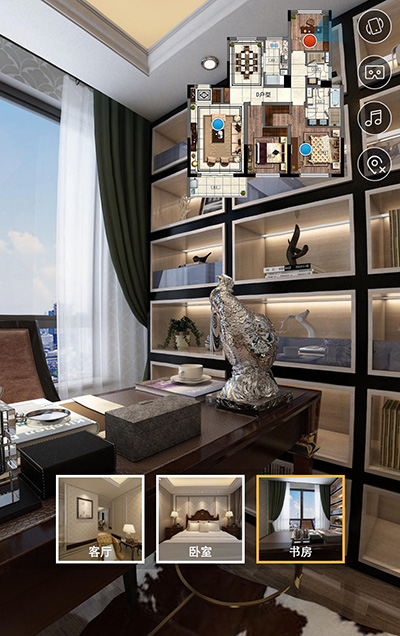

# krpano移动端解决方案



### 功能：
* 右侧快捷操作入口：
	1. 重力感应开关
	2. vr模式开关
	3. 音乐开关
	4. 沙盘开关
* 底部：
	1. 场景缩略图列表，可快捷切换场景


### 使用方式：
在项目的xml文件内引入
```
<include name="include" url="[krpano包]/config.xml" />
```
并写入配置
```
<config name="config"
	gravity="true"
	vr="true"
	bgsound="krpano/sound.mp3"
	bgsoundplay="false"
	x="10"
	y="10"
	entry="keting" />
```
说明：  
`gravity`：是否启用重力感应  
`vr`：是否启用vr功能  
`bgsound`：背景音乐的路径  
`bgsoundplay`：背景音乐是否自动播放  
`x`、`y`：距离右上角的x轴与y轴位置，这两个值默认为10  
`entry`：入口场景  
以上参数中`gravity`、`vr`、`bgsound`为`false`时，该功能按钮不显示  


```
<sandmap name="sandmap"
	visible="false"
	bg="src/sandmap.png"
	width="200"
	height="231" />
```
说明：  
`visible`：是否一直保持显示状态，建议`false`  
`bg`：沙盘的背景图
`width`：沙盘的宽度  
`height`：沙盘的高度  
`sandmap`中每个场景的坐标在每个场景的`<scene ...>`中设置  
`pointx`与`pointy`设置场景小圆点的坐标位置  
`direction`设置小圆点的初始箭头指向  
`sandmap`标签若没有，则沙盘功能不显示  

另外`<scene ...>`中如果有`thumburl`和`title`这两属性，则会被列到下方的场景列表中去。


### 入口箭头：
```
<hotspot style="hotspot"
	direction="right"
	ath="12.878134636095"
	atv="10.3502532533291"
	link="woshi"
	title="卧室" />
```
在`<scene ...>`内可加入`hotspot`箭头，其中`style`不能更改，或者你要自己重写该箭头的样式那随意  
`direction`：只3种，`left`、`right`或`ahead`，箭头分别向左，右和前  
`ath`和`atv`：分别为场景内的横向和纵向坐标  
`link`：链接的场景  
`title`：文字将会在箭头上显示  


### 目录结构：
```
|- krpano krpano包以及插件
|- src
|	|- xml.xml 项目配置文件
|	|- sandmap.png 沙盘地图
|	|- [name] 每个全景的素材图片
|		|- mobile_b.jpg 后方
|		|- mobile_d.jpg 下方
|		|- mobile_f.jpg 前方
|		|- mobile_l.jpg 左侧
|		|- mobile_r.jpg 右侧
|		|- mobile_u.jpg 顶侧
|		|- preview.jpg 预览图
|		|- thumb.jpg 缩略图
```
图片处理方式请参考krpano官网，这里不做介绍。