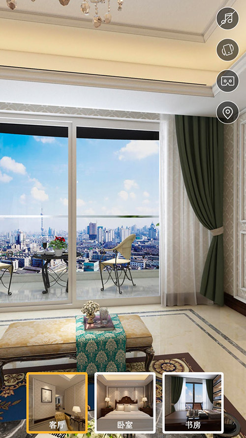
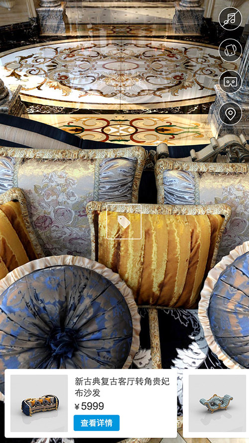

# krpano移动端解决方案

  


## 功能：
* 右侧快捷操作入口：
	1. 重力感应开关
	2. vr模式开关
	3. 音乐开关
	4. 沙盘开关
* 底部：
	1. 场景缩略图列表，可快捷切换场景
	2. 标签列表，可在全景中打标签，点击标签后在底部显示相应的产品列表


## 使用方式：
在项目的xml文件内引入
```
<include name="include" url="dist/base.xml" />
```
该文件包括以下功能：  
* 提示框
* 音乐播放插件
* 重力感应插件
* VR插件
* 沙盘插件
* 场景切换标签与快捷切换插件

## 全景入口配置：
```
<entry scene="keting" />
```
以上范例中将入口配置到`<scene name="keting" ... />`的场景中


### 音乐播放：
```
<sound x="10" y="10" url="./sound.mp3" autoplay="false" />
```
`x`：播放器开关的x坐标（右对齐方式）  
`y`：播放器开关的y坐标（顶对齐方式）  
`url`：播放的音频文件地址  
`autoplay`：自动播放，ios不支持自动播放，建议该值为false  
不写入该代码则没有该功能  


### 重力感应：
```
<gravity x="10" y="65" enabled="true" />
```
`x`：重力感应开关的x坐标（右对齐方式）  
`y`：重力感应开关的y坐标（顶对齐方式）  
`enabled`：是否自动开启该功能  
不写入该代码则没有该功能  


### VR入口：
```
<vr x="10" y="120" />
```
`x`：VR入口的x坐标（右对齐方式）  
`y`：VR入口的y坐标（顶对齐方式）  
不写入该代码则没有该功能  


### 沙盘：
```
<sandmap x="10" y="175" width="200" height="231" map="sandmap.png" mapx="55" mapy="10">
	<point name="p1" scene="woshi" x="150" y="170" direction="90" />
	<point name="p2" scene="shufang" x="155" y="40" direction="15" />
	<point name="p3" scene="keting" x="45" y="140" direction="10" />
</sandmap>
```
目前沙盘只支持一张map图，即所有场景都在一个层面时适合，不适合用于别墅等多层面的场景   
`<sandmap>`中以下属性：  
`x`：入口的x坐标（右对齐方式） 
`y`：入口的y坐标（顶对齐方式） 
`map`：沙盘图片地址   
`width`：沙盘图片宽度  
`height`：沙盘图片高度  
`mapx`：沙盘地图的x坐标（右对齐方式） 
`mapy`：沙盘地图的y坐标（顶对齐方式） 

`<point>`是沙盘中的坐标点，可以点击快捷进入，同时也显示当前的朝向  
属性如下：  
`name`：唯一标识，与其他`point`不重复即可
`scene`：对应的场景  
`x`：点的x坐标（左对齐方式）  
`y`：点的x坐标（顶对齐方式）  
`direction`：方向，或者可以说是方向的偏移量，会与场景中的方向相加  


### 场景中的链接
```
<scenelink>
	<link name="l1" atscene="keting" ath="12.8" atv="10.3" to="woshi" title="卧室" direction="right" />
	<link name="l2" atscene="keting" ath="11.8" atv="0.4" to="shufang" title="书房" direction="left" />
	<link name="l3" atscene="woshi" ath="249" atv="15.7" to="shufang" title="书房" />
	<link name="l4" atscene="shufang" ath="198" atv="22" to="keting" title="客厅" direction="left" />
	<link name="l5" atscene="shufang" ath="200" atv="12" to="woshi" title="卧室" />
</scenelink>
```
原先这部分是分散写在`<scene>`中的，为了编辑起来更顺手重构了这部分功能，用`scenelink`包裹所有链接  
`<link>`中的属性如下：
`name`：唯一标识，与其他`link`不重复即可  
`atscene`：在哪个场景中显示  
`ath`：在场景中的横向角度坐标  
`atv`：在场景中的纵向角度坐标  
`to`：链接到的场景  
`title`：标题名称  
`direction`：箭头方向，方向分3种，左/右/前，分别是`left`、`right`，向前不用写即可   


### 场景快捷切换：
   
该功能无配置，主要依靠在写入`<scene ...>`时有无`thumburl`和`title`这两属性决定   
`thumburl`：缩略图   
`title`：标题  
若有这两个属性并且在项目中超过2个或以上的场景，自动生成快捷切换功能  

### 产品模块：
在examples/mall案例中展示该功能，大致就是在全景中对某个物件打标签，点击标签时在全景下方弹出列表查看产品
```
<mall>
	<tag name="t1" atscene="keting" atv="10" ath="240" product="p1" />
	<tag name="t2" atscene="keting" atv="50" ath="90" product="p1|p2" />
		
	<product name="p1"
		title="锌合金吊灯欧式卧室客厅灯玉石水晶灯"
		thumb="products/1.jpg"
		price="4180"
		btntext="查看详情"
		btncolor="0x2f96da"
		callback="alert('call js');" />

	<product name="p2"
		title="锌合金吊灯欧式卧室客厅灯玉石水晶灯"
		thumb="products/1.jpg"
		price="4180"
		btntext="查看详情"
		btncolor="0x2f96da"
		callback="alert('call js');" />

</mall>
```
所有数据包裹在`mall`中，里面分2部分内容，`tag`与`product`  
`<tag>`是场景中的标签部分，属性如下：  
`name`：唯一标识，与其他`tag`不重复即可  
`atscene`：在哪个场景中显示  
`ath`：在场景中的横向角度坐标  
`atv`：在场景中的纵向角度坐标  
`product`：对应的产品标识，如果有多个用`|`分割，点击时会根据标识按序显示  

`<product>`是场景中的产品部分，属性如下：  
`name`：唯一标识，与其他`product`不重复即可，注意的是`tag`中的`product`属性和`<product>`标签的`name`是相对应的  
`title`：产品名称  
`thumb`：缩略图  
`price`：产品价格  
`btntext`：按钮文字  
`btncolor`：按钮底色，文字颜色为白色，因为一般按钮不会用浅色底，所以文字颜色目前没有列入可配置范围  
`callback`：回调函数  
`link`：链接地址，如果与回调函数同时存在，则只使用回调函数  


### 目录结构：
```
|- dist 打包
|- src 插件以及二次开发的全部源码
|- examples
|-	|-[example]
|		|- index.html 引用js与初始化配置
|		|- xml.xml 项目配置文件
|		|- sound.mp3 音频文件
|		|- sandmap.png 沙盘地图
|		|- [name] 每个全景的素材图片
|			|- mobile_b.jpg 后方
|			|- mobile_d.jpg 下方
|			|- mobile_f.jpg 前方
|			|- mobile_l.jpg 左侧
|			|- mobile_r.jpg 右侧
|			|- mobile_u.jpg 顶侧
|			|- preview.jpg 预览图
|			|- thumb.jpg 缩略图
```
图片处理方式请参考krpano官网，这里不做介绍。


#### 另外几个问题，dist中的代码为纯手工打包的，因为大多为xml文件，webpack不好处理
#### 至于为什么用xml写而不用js写plugin，是为了能打包成一个文件
#### 另外若要对其商业化使用，请将`krpano.js`更换，因为这个是我们购买过的，若出现版权问题请不要找我...